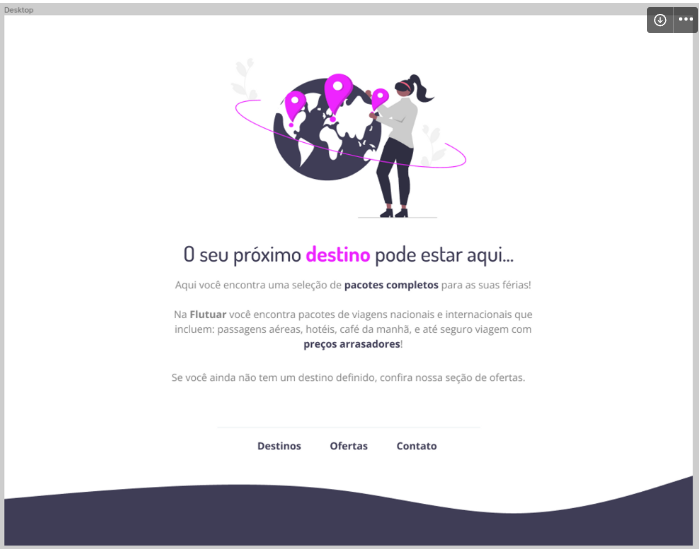

  

## 🖥️ Projeto
Treinos exclusivos para você.

## ✍️ Aprendizagem

* Fontes & cores
* Posicionando textos e elementos
* Enviando projetos para o Github
* Acessibilidade
* Tags semânticas
* Interpretação de layouts (Figma)
 

## 🚀 Tecnologias
Esse projeto foi desenvolvido durante o EXPLORER- programação web da Rocketseat com as seguintes tecnologias:

* HTML
* CSS

## 🏷️ Layout
Você pode visualizar o layout do projeto através 
[desse link](https://www.figma.com/file/c7BoY0CT0XC6vmWsVlXGsB/Projeto01-Extra-(Copy)?type=design&node-id=0%3A1&t=okRJgcOQqwXRHCEp-1). 
É necessário ter uma conta no [Figma](https://www.figma.com)

Feito com ❤️ por <strong>Luciana</strong>. Me acompanhe nas [redes sociais!](https://luciana-maria.github.io/Cartao-de-visita-Rocketseat/)